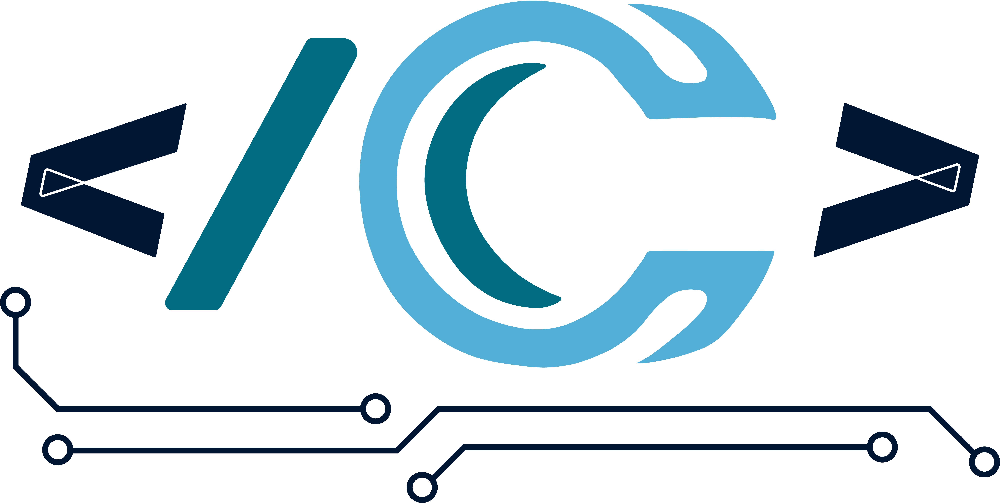

<br />
<div align="center">
  <a href="https://codicam.com">
    
  </a>

  <h3 align="center">Projet Tour Commande numérique</h3>

  <p align="center">
    Projet de réalisation d'un POC 
    <br />

  </p>
</div>


<!-- LE PROJET -->
## LE PROJET

<div align="center">
    
</div>


### CREE AVEC :

Python pour le back et Qt creator pour le front


<!-- GETTING STARTED -->
## Lancement de l'application


### Les pré-requis

Téléchargement des librairies
  ```sh
  pip install -r requirement.txt
  ```

### Installation / Lancement de l'app 


1. Cloner le projet
   ```sh
   git clone https://github.com/Soluce-Development/Maquette
   ```
2. installation des librairies
   ```sh
    pip install -r requirement.txt
   ```
4. Lancer le projet `main.py`
   ```py
   python main.py
   ```


<!-- USAGE EXAMPLES -->
## Utlisation

Programme réalisé dans le cadre du developpement d'un POC démonstrateur de tour numérique.
_Pour plus d'informations [Contact](https://codicam.com)_


<!-- LICENSE -->
## License

Distribué par l'association Codicam - ICAM. Nous contacter pour plus de details.


<!-- CONTACT -->
## Contact

Codicam- codicam.com

Project Link: [https://github.com/Soluce-Development/Maquette](https://github.com/Soluce-Development/Maquette)


