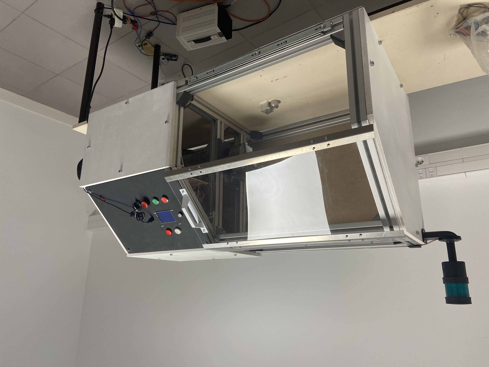

<br />
<div align="center">
  <a href="https://codicam.com">
    
  </a>

  <h3 align="center">Démonstrateur de tour à commande numérique</h3>

  <p align="center">
    Projet de réalisation d'un PoC 
    <br />

  </p>
</div>


<!-- LE PROJET -->
## LE PROJET

<div align="center">
    
</div>


### CREE AVEC :

Python pour la logique et Qt Creator pour le design des interfaces.


## Lancement de l'application


### Installation / Lancement de l'app 


1. Cloner le projet
   ```sh
   git clone https://github.com/Soluce-Development/Maquette
   ```
2. installation des librairies
   ```sh
    pip install -r requirement.txt
   ```
4. Lancer le projet `main.py`
   ```py
   python main.py
   ```

## Utilisation

Programme réalisé dans le cadre du développement d'un PoC de démonstrateur de tour numérique.


## License

Distribué par l'association Codicam - ICAM. Nous contacter pour plus de details.


## Contact

Codicam - [codicam.com](https://codicam.com)


